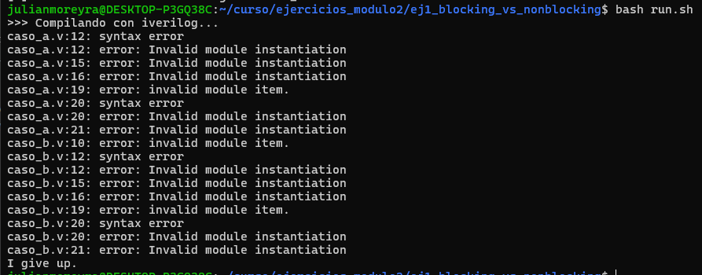
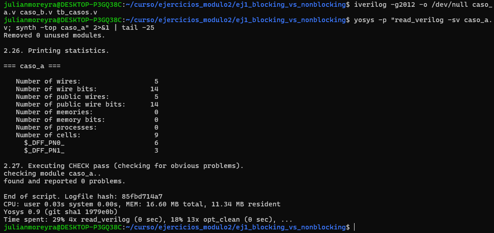
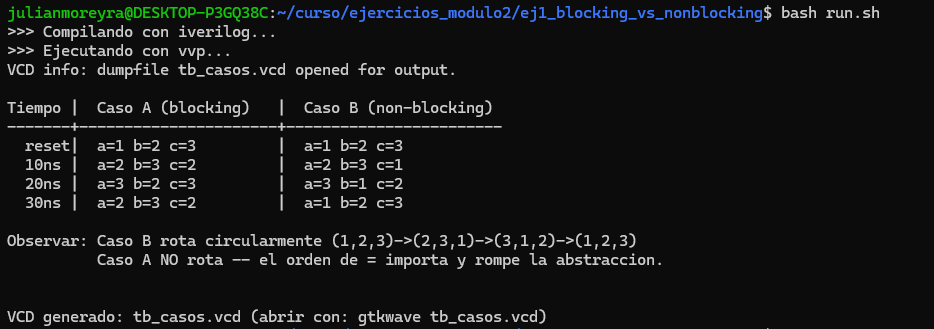
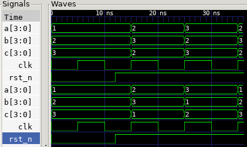

# Ejercicio 1 — Análisis — Blocking vs Non-blocking

a) Predecir los valores de a, b, c tras el primer y segundo
posedge clk, asumiendo a=1, b=2, c=3 antes del primer flanco.

| Dato | Valor |
|---|---|
| Valores iniciales | `a=1`, `b=2`, `c=3` |
| Clock | 50 % duty, período 10 ns |
| Alcance | 2 flancos consecutivos (t = 10 ns y t = 20 ns) |

# Caso A

    ── Caso A (blocking) ──

    always_ff @(posedge clk) begin
        a = b; 
        b = c; 
        c = a;
    end

| Señal | t = 0 | t = 10 ns (1° posedge) | t = 20 ns (2° posedge) |
|:---:|:---:|:---:|:---:|
| `a` | 1 | 2 | 3 |
| `b` | 2 | 3 | 2 |
| `c` | 3 | 2 | 3 |

# Caso B

    ── Caso B (non-blocking) ──

    always_ff @(posedge clk) begin
        a <= b; 
        b <= c; 
        c <= a;
    end

| Señal | t = 0 | t = 10 ns (1° posedge) | t = 20 ns (2° posedge) |
|:---:|:---:|:---:|:---:|
| `a` | 1 | 2 | 3 |
| `b` | 2 | 3 | 1 |
| `c` | 3 | 1 | 2 |

Un tercer flanco permite decidir
la pregunta del rotador circular de forma concluyente:
 
| Señal | Caso A, t = 30 ns | Caso B, t = 30 ns |
|:---:|:---:|:---:|
| `a` | 2 | 1 |
| `b` | 3 | 2 |
| `c` | 2 | 3 |

b) ¿Cuál es el estilo correcto?

El estilo correcto para desarrollar un rotador circular real es el estilo `no bloqueante` que emplea el operador `<=`, esto debido a lo que hace el simulador con las señales que lo emplean. No se ejecuta las líneas de manera secuencial reemplazando los valores en el mismo instante, lo que sucede es que el simulador utiliza los valores "viejos" para reemplazarlos luego en cada caso. Esto se corresponde con el funcionamiento real de los flip-flops que se actualizan todos en el mismo instante según un flanco de reloj, por lo que el orden de los mismos no influye en el resultado.

Emplear el operador `=` produce que el orden de las sentencias determine el resultado, rompiendo con la correspondencia del hardware: los flip-flops no tienen orden. Además, si el mismo cálculo se reparte en varios bloques `always` sensibles al mismo flanco, aparece una condición de carrera, porque el estándard IEEE no define el orden de ejecución entre bloques y el resultado deja de ser determinista.

c) ¿Cuál implementa un rotador circular real?

    Un rotador circular de N señales debe volver al estado inicial exactamente después de N flancos, sin perder ni duplicar ningún valor.

Notamos que en el caso A dos de las tres señales toman el mismo valor a partir del primer flanco, es decir que un dato se duplica. Como la cantidad total de señales no cambia, esa duplicación implica necesariamente que otro valor se perdió: el 1 desaparece y no vuelve a aparecer en ningún estado posterior. Además, tras tres flancos el sistema no regresa al estado inicial.

El caso B (caso no bloqueante) es el caso que realmente implementa un rotador circular ya que en ningún estado se pierde algún valor y luego de tres flancos después del reset logra volver al valor inicial.

d) ¿Es legal usar always_ff en ambos casos?

Según el estándard, IEEE 1800 impone a `always_ff` tres restricciones explícitas:
 
1. Debe contener **un solo** control de evento (un único `@(...)`).
2. No puede contener controles temporales bloqueantes en el cuerpo
   (`#delay`, `@`, `wait` intercalados).
3. Las variables que asigna **no pueden ser asignadas por ningún otro proceso**

Entonces, como tal el estándar no prohíbe que se utilicen asignaciones bloqueantes dentro de un `always_ff`, sin embargo, always_ff es una declaración de intención: modela lógica secuencial disparada por flanco. Y el valor de `<=` en ese contexto es exactamente uno: garantizar que el resultado no dependa del orden, ni del orden de las sentencias dentro del bloque, ni del orden en que el simulador elija ejecutar bloques distintos disparados por el mismo flanco. Utilizar `=` adentro nos elimina esa garantía

Se verificó el comportamiento de las herramientas reemplazando `always` por `always_ff`. Con iverilog sin -g2012 la construcción es rechazada, ya que en modo Verilog-2001 `always_ff` no es palabra reservada y el parser la interpreta como una instanciación de módulo: 

Con iverilog -g2012 la compilación es limpia, sin errores ni advertencias. Con yosys (read_verilog -sv) la síntesis completa el flujo y reporta found and reported 0 problems, infiriendo flip-flops D con reset asíncrono:

Es decir: ninguna de las herramientas que soportan la construcción interfieren ante el uso de `=` dentro de `always_ff`. El error no se observa en la compilación sino en el comportamiento del circuito, lo que refuerza que la decisión de estilo no tiene sustituto automático.

---

# Bonus — Simulación en Icarus Verilog

A continuación utilizaremos los archivos `caso_a.v`, `caso_b.v` y `tb_casos.v` para comparar estos casos. Estos casos incorporan una rama de reset asíncrono
(`always @(posedge clk or negedge rst_n)`)

Se ejecuta el script por medio de la terminal de Ubuntu:

`$ bash run.sh`

--- 

Notamos que el reset se libera en t=12[ns] por lo que en el flanco de 5[ns] "rst_n" sigue activo y el bloque entra por esa rama, por eso los valores no cambian, el primer flanco con efecto es el de 15[ns].

| Señal | Inicio | Primer flanco ascendente (5ns)| Segundo flanco ascendente (15ns) | Tercer flanco ascendente (25ns) | Cuarto flanco ascendente (35ns) |
| :---: | :---: | :---: | :---: | :---: | :---: |
| a | 1 | 1 | 2 | 3 | 2 |
| b | 2 | 2 | 3 | 2 | 3 |
| c | 3 | 3 | 2 | 3 | 2 |

| Señal | Inicio | Primer flanco ascendente (5ns)| Segundo flanco ascendente (15ns) | Tercer flanco ascendente (25ns) | Cuarto flanco ascendente (35ns) |
| :---: | :---: | :---: | :---: | :---: | :---: |
| a | 1 | 1 | 2 | 3 | 1 |
| b | 2 | 2 | 3 | 1 | 2 |
| c | 3 | 3 | 1 | 2 | 3 |

Observamos como estos valores coinciden con la simulación, mediante la herramienta GTKWave podemos ver y corroborarlos:

Las tres primeras señales corresponden al `Caso A (bloqueante)` y las otras tres corresponden al `Caso B (no bloqueante)`.

En el VCD se confirma que en el flanco de 5[ns] ninguna de las seis señales cambia, evidenciando que el reset asíncrono sostiene el valor de forma continua mientras está activo. Las transiciones ocurren en 15, 25 y 35 ns. Se observa además que en el caso A dos de las tres señales toman el mismo valor después de cada flanco, lo que anticipa la duplicación de datos analizada en el punto (c)