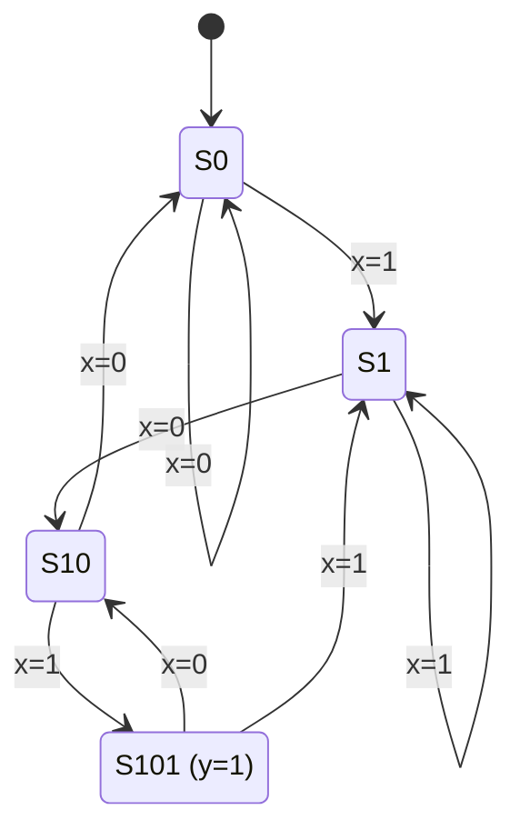

# Informe Ejercicio 4 - FSM Detector de secuencia 101

## Motivación

Se implementa una FSM tipo Moore que detecta la secuencia binaria "101" en una entrada serial `x`, levantando `y=1` durante un único ciclo de clock al completarse la detección. El detector es solapado: el bit "1" que cierra una detección puede ser a la vez el primer bit de la siguiente búsqueda (por ejemplo, en "10101" hay dos detecciones, no una). Al ser Moore, `y` depende exclusivamente del estado actual (`y=f(estado)`), nunca de `x` directamente, evitando glitches combinacionales en la salida.

## Implementación

### Módulo

`detector_101.v` usa 4 estados con codificación binaria (`S0=00, S1=01, S10=10, S101=11`) y 3 bloques `always`: registro de estado (secuencial, reset asíncrono activo en bajo), próximo estado (combinacional) y salida (combinacional, Moore).

La tabla de transición es:

| Estado | x=0 | x=1 |
|---|---|---|
| S0 | S0 | S1 |
| S1 | S10 | S1 |
| S10 | S0 | S101 |
| S101 | S10 | S1 |

El punto no trivial es la fila de `S101`: dado que el patrón "101" siempre termina en "1", al llegar a `S101` el sistema ya tiene un "1" "en curso" que puede iniciar una nueva búsqueda. Por eso las transiciones salientes de `S101` son idénticas a las de `S1` (con x=1 va a `S1`, tal como indica la consigna; con x=0 va a `S10`, en vez de reiniciar a `S0`), logrando el solapamiento correcto.

Diagrama de estados:



### Test Bench

`tb_detector_101.v` aplica la secuencia `"11010110101"` bit a bit: en cada ciclo fija `x`, espera el flanco de clock y muestrea `y` justo después, momento en que `y` ya refleja el estado actualizado con ese bit. Para no hardcodear la salida esperada, se replica la misma tabla de transición en una función `golden_next`, que calcula el próximo estado del modelo en paralelo al DUT; la detección esperada se marca cuando ese próximo estado es `S101`. Se cuentan detecciones esperadas y obtenidas, y se reporta cualquier mismatch bit a bit junto con un veredicto final `PASS`/`FAIL`.

## Resultados

```
----------------------------------------
Detecciones esperadas: 4
Detecciones obtenidas: 4
Errores:               0
RESULTADO: PASS
----------------------------------------
```

Para la secuencia "11010110101" hay 4 ocurrencias solapadas de "101" (en los bits que terminan en las posiciones 4, 6, 9 y 11), y el detector las encuentra todas sin errores, incluyendo el caso de solapamiento en las posiciones 4-6 y 9-11.
