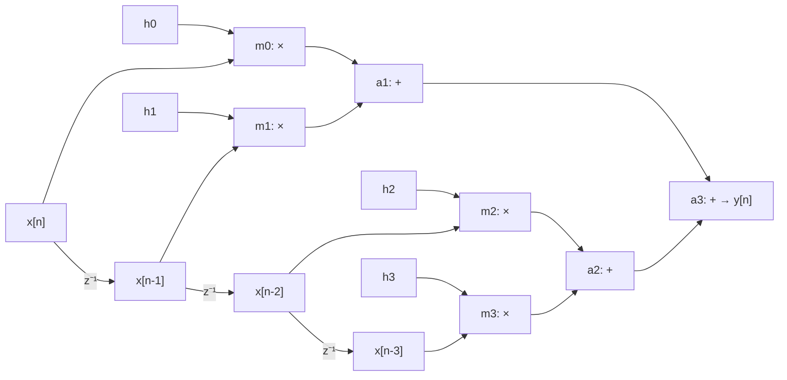

# Informe Ejercicio 1 - DFG de un FIR de 4 coeficientes

## Motivación

Antes de planificar en qué ciclo va cada operación (ej2), hace falta el grafo: sin DFG el
paralelismo real del algoritmo queda oculto detrás de la ecuación. Este ejercicio fija el DFG
que van a reusar los ejercicios 2, 4 y 5 — la elección de estructura (árbol vs. cadena) y los
nombres de los nodos quedan congelados acá para que las comparaciones entre ejercicios tengan
sentido.

## El FIR

Forma directa, 4 coeficientes:

```
y[n] = h0*x[n] + h1*x[n-1] + h2*x[n-2] + h3*x[n-3]
```

`x[n-1]`, `x[n-2]`, `x[n-3]` no son entradas nuevas: son `x[n]` retardada por una línea de 3
registros `z⁻¹` en cascada. Esos registros **no** forman parte del cómputo aritmético del DFG,
pero son los que producen los operandos de los multiplicadores — hay que dibujarlos.

## Nodos y aristas

| Nodo | Operación | Entradas |
|---|---|---|
| `m0` | `×` | `h0`, `x[n]` |
| `m1` | `×` | `h1`, `x[n-1]` |
| `m2` | `×` | `h2`, `x[n-2]` |
| `m3` | `×` | `h3`, `x[n-3]` |
| `a1` | `+` | `m0`, `m1` |
| `a2` | `+` | `m2`, `m3` |
| `a3` | `+` | `a1`, `a2` → `y[n]` |

**Decisión de diseño: suma en árbol, no en cadena.** Con recursos ilimitados, `a1 = m0+m1` y
`a2 = m2+m3` no dependen entre sí y pueden ejecutar en paralelo; solo `a3` espera a ambas. Una
cadena (`a1=m0+m1`, `a2=a1+m2`, `a3=a2+m3`) fuerza una dependencia RAW artificial entre `a1` y
`a2` que no existe en la matemática del filtro — agregaría un nivel más al camino crítico sin
ninguna ventaja. El árbol es estrictamente mejor acá y es la forma que va a hacer más interesante
el ASAP/ALAP del ej2 (más movilidad para explorar).

Todas las aristas `m_i → a_j` y `a1,a2 → a3` son dependencias **RAW**: cada suma necesita el
resultado numérico de sus entradas, no solo que el recurso esté libre.

## Diagrama



## Camino crítico

Latencias de referencia para todo el módulo (fijadas acá, reusadas en ej4/ej6):
`t_mul = 2 tu`, `t_add = 1 tu`.

Camino más largo: `m_i → a1|a2 → a3`, es decir **1 mult + 2 add = 4 tu**. Ningún camino pasa por
3 sumadores porque el árbol evita la cadena de 3 adds. Este es el número que ej4 va a intentar
bajar con pipelining, y el que ej2 va a mostrar que tiene movilidad 0 en `a3` (siempre el
último en poder ejecutar).
