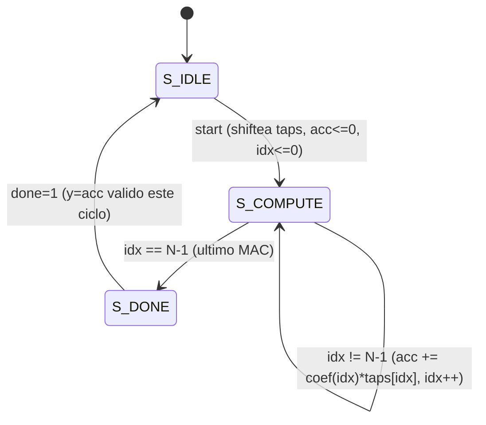

# Informe Ejercicio 3 - FIR iterativo (1 mult + 1 add compartidos)

## Motivación

El ej2 mostró movilidad 0 en las 7 operaciones del DFG del FIR (árbol balanceado): no hay
ciclos ociosos que aprovechar para compartir hardware sin penalizar latencia. Este ejercicio
verifica esa predicción en la práctica: en vez de estimar latencia/throughput a mano, se
implementa el folding total del DFG (4 multiplicaciones + 3 sumas → 1 multiplicador + 1 sumador
reutilizados N=4 veces) y se mide con un testbench, igual que el multiplicador secuencial de
`clase4/ej4-shift-n-add-multiplier` (mismo patrón de `ej3_iterativo/control_fsm.sv` + datapath + TB
self-checking).

## Arquitectura

- `ej3_iterativo/fir_iter.sv`: línea de retardo `taps[0..3]` (`taps[0]=x[n]`, más nuevo), un
  acumulador y un único par multiplicador+sumador. Cada ciclo de cómputo hace
  `acc <= acc + coef(idx)*taps[idx]` — un producto-y-suma combinacional por ciclo, registrado
  (MAC de 1 ciclo, no 2 separados: el recurso compartido es "1 multiplicador + 1 sumador", no
  "1 ciclo por operador").
- `ej3_iterativo/control_fsm.sv`: mismo esqueleto que `clase4/ej4.../control_fsm.sv`
  (IDLE/COMPUTE/DONE), parametrizado en `N` en vez de fijo a un ancho de multiplicando. Expone
  `idx` (el tap/coef actual) además de `load`/`mac`/`done`/`busy`.



Nota sobre Icarus: los coeficientes iban originalmente como `localparam` de array unpacked
(`H[0:N-1] = '{...}`), pero Icarus lo rechaza (`sorry: unpacked array parameters are not
supported yet`) — se resolvió con una función `coef(idx)` (`case` combinacional), replicada
también en el testbench (`coef_ref`) para que el golden model no dependa de un array que el DUT
no puede exponer como parámetro.

## Recursos compartidos vs. ej1 (recursos ilimitados)

| | ej1/ej2 (ASAP, ilimitado) | ej3 (iterativo) |
|---|---|---|
| Multiplicadores | 4 (todos en ciclo 1) | 1 |
| Sumadores | 2 (ambos en ciclo 2) | 1 |
| Latencia | 3 ciclos | 4 ciclos |

## Resultados medidos (`ej3_iterativo/run.sh`)

```
RESULTADO: OK - sin discrepancias
LATENCIA: OK - 4 ciclos constantes en las 205 muestras
THROUGHPUT: 6.00 ciclos/muestra medidos (back-to-back, 200 muestras)
```

205 muestras (5 casos límite + 200 pseudoaleatorias, ventana deslizante de 4 muestras signadas
de 8 bits) verificadas contra un golden model que replica la línea de retardo del DUT — sin
discrepancias.

**Latencia = 4 ciclos**, exactamente `N` — el mínimo posible con 1 multiplicador y 1 sumador
compartidos, porque cada uno de los 4 términos `h_i·taps[i]` necesita su propio ciclo de MAC:
confirma en simulación lo que el ej2 ya anticipaba (movilidad 0 ⇒ compartir hardware no puede
lograr los 3 ciclos del ASAP ideal).

**Throughput = 6 ciclos/muestra medido**, por encima del mínimo teórico de la FSM
(`N+1 = 5`: 4 ciclos de `S_COMPUTE` + 1 de `S_DONE` antes de volver a `S_IDLE` y aceptar el
próximo `start`). La diferencia de 1 ciclo es overhead del *driver* del testbench, no de la FSM:
`aplicar_muestra()` mantiene `start` en alto durante un período completo (lo baja recién en el
siguiente `negedge`) en vez de pulsarlo un único flanco, lo que le agrega un ciclo de margen a
cada muestra. Con un `start` pulsado más ajustado se alcanzaría el mínimo de 5 ciclos/muestra
que impone la FSM.

En cualquier caso, el patrón es el de **folding** (slide 39 de la presentación): throughput cae
a ~1/6 respecto del ASAP ideal (1/3) a cambio de área mínima (1 mult + 1 add en vez de 4+2) —
exactamente el trade-off que el ej5 va a tabular junto con la versión pipeline del ej4.
