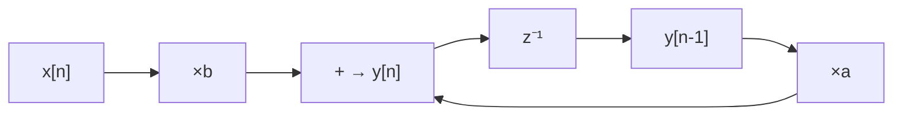

# Informe Ejercicio 6 - Conversión a IIR y cálculo de IPB

## Motivación

Todo lo anterior (ej1-ej5) es feed-forward: sin importar cuánto pipeline se le meta, el
camino combinacional siempre se puede partir en más etapas porque ninguna señal depende de una
salida futura de sí misma. Un IIR rompe esa propiedad: aparece un lazo, y un lazo impone un piso
de período de clock que **ningún pipeline ni retiming puede bajar** — el IPB (slide 32). Este
ejercicio construye ese lazo a partir del mismo FIR y mide ese piso.

## El IIR de 1er orden

```
y[n] = a·y[n-1] + b·x[n]
```

Un multiplicador (`b·x[n]`) queda igual que en el FIR — es feed-forward, `x[n]` es una entrada
fresca. Lo nuevo es el segundo multiplicador: en vez de tomar `x[n-1]` de una línea de retardo
alimentada por una entrada externa, toma `y[n-1]` — la salida del propio sumador, retrasada un
ciclo. Eso cierra el lazo.



## Cálculo del IPB

**Lazo**: el único camino que sale de un nodo y vuelve a sí mismo es
`add → z⁻¹ → ×a → add`. El multiplicador `×b` **no** es parte del lazo — su entrada (`x[n]`) es
siempre externa, nunca depende de una salida anterior del propio filtro.

Usando las mismas latencias de referencia de ej1/ej3/ej4 (`t_mul = 2 tu`, `t_add = 1 tu`):

| | Valor |
|---|---|
| Nodos del lazo | `×a` (2 tu), `+` (1 tu) |
| `T_lazo` (suma de latencias de los nodos del lazo) | 2 + 1 = **3 tu** |
| `D_lazo` (registros `z⁻¹` en el lazo) | **1** |
| `LB = T_lazo / D_lazo` | 3 tu |

Un solo lazo en todo el DFG ⇒ **`IPB = max(LBᵢ) = 3 tu`**. Por más pipeline o retiming que se
aplique **fuera** del lazo (por ejemplo, al camino de `×b`), el período de clock de este filtro
nunca puede bajar de 3 tu: cada nueva muestra de `y[n]` necesita el `y[n-1]` que el propio
sumador recién terminó de calcular, y entre ambos solo hay 1 registro para amortiguar ese
retardo. Es la diferencia estructural con el FIR de ej1-ej5: ahí no había ningún lazo, así que
no había ningún IPB — el camino crítico se podía acortar arbitrariamente agregando más cortes.

**Verificación**: `ej6_ipb/verify_ipb.py` define `IPB = max(T_lazo_i/D_lazo_i)` como
una función genérica sobre una lista de lazos `(T_lazo, D_lazo)` — no hardcodea el resultado
`3 tu`, lo calcula a partir de `T_MUL=2tu`, `T_ADD=1tu` y `D_lazo=1` fijados arriba, usando
`fractions.Fraction` para que la división no pierda precisión. Corre con
`cd ej6_ipb && python3 verify_ipb.py`: reproduce el `3 tu` de la tabla y, de paso, el `1.5 tu`
de la sección de look-ahead más abajo (mismo `T_lazo`, `D_lazo=2`) — un solo cálculo genérico
cubre los dos casos del informe.

## Bajar el IPB

El IPB es un límite **del DFG actual**, no del algoritmo — cambiar el grafo (sin cambiar la
secuencia `y[n]` que produce) puede bajarlo.

### Shannon — no es la herramienta correcta acá

La descomposición de Shannon parte una función según el valor de una entrada de control (slide
28): sirve cuando *una* señal llega tarde y el resto de la lógica puede precomputarse para sus
dos valores posibles, muxeando al final (slide 34: precomputar 2 versiones del lazo y elegir
con 1 mux corta el `T_lazo` efectivo a la mitad, a costa de ~2× área en esa etapa). El problema
es que en este lazo no hay ninguna entrada de control — es una recursión aritmética pura
(`×a` seguido de `+`), no hay un bit "lento" natural sobre el que pivotear. Para aplicar Shannon
acá haría falta identificar un bit realmente tardío en la cadena de acarreo del sumador o del
multiplicador (p.ej. el bit más significativo de `y[n-1]`), precomputar ambas ramas del
`+b·x[n]` para los dos valores posibles de ese bit, y muxear cuando resuelve — una optimización
de bajo nivel, específica de la implementación del sumador/multiplicador, no algo que se pueda
aplicar a nivel de DFG en general como en el FIR. No es la primera herramienta a la que
recurrir para bajar el IPB de esta recursión.

### C-Slow — válido con 1 stream, pero solo mejora el throughput con varios

C-Slow (o K-slow) reemplaza cada registro del lazo por `C` registros (slide 36). **Corrección
respecto a una versión anterior de esta sección**: no hace falta tener streams independientes
para que la técnica sea *válida* — con 1 solo stream, C-Slow sigue calculando exactamente la
misma secuencia `y[n]`, alimentando una muestra real cada `C` ciclos y "operaciones nulas" en
los ciclos intermedios (así lo muestra el ejemplo de K-slow de `chap4.pdf` de Parhi:
reemplazar 1 registro por 2 no cambia qué se computa, solo estira el `Titer` real por el mismo
factor `C` que se ganó de `T_clk`, dejando el hardware al `1/C` de utilización). Con `D_lazo=1`
acá, reemplazarlo por `C=2` registros da `T_clk = T_lazo/2 = 1.5 tu`, pero con 1 solo canal el
`Titer` real vuelve a ser `2 × 1.5 tu = 3 tu` — **el mismo IPB de antes**, no una mejora: se
bajó el período de reloj físico, pero cada muestra real sigue necesitando el mismo tiempo total
porque solo 1 de cada 2 ciclos lleva dato útil.

**Si el caso de uso es multicanal** (este mismo filtro aplicado a 2 canales de audio con el
mismo coeficiente `a`, compartiendo el hardware) ahí sí se gana algo real: los 2 ciclos que
antes tenían 1 útil + 1 nulo ahora llevan 1 muestra de cada canal — cada canal sigue viendo su
propio IPB de 3 tu en tiempo real (nada mejora *por canal*, sigue siendo el mismo cálculo), pero
el hardware compartido sirve el doble de canales al mismo costo de área — mismo resultado que
el folding de ej3, aplicado al lazo en vez de al feed-forward.

### La herramienta que realmente baja el IPB de un único canal: look-ahead

Ninguna de las dos anteriores baja el IPB de un canal *individual* sin trucos de bajo nivel o
sin streams extra. La técnica estándar en DSP para esto es el **look-ahead** (no cubierto en la
presentación, pero vale mencionarlo): desenrollar la recursión algebraicamente —
`y[n] = a·(a·y[n-2] + b·x[n-1]) + b·x[n] = a²·y[n-2] + (a·b)·x[n-1] + b·x[n]` — que sigue
produciendo *exactamente* la misma secuencia `y[n]`, pero ahora el lazo pasa por `y[n-2]`
(2 registros) en vez de `y[n-1]` (1 registro), con `T_lazo` prácticamente igual (`a²` y `a·b`
son constantes, se precalculan una sola vez fuera del lazo): `IPB_nuevo = T_lazo/2 = 1.5 tu`,
igual que el C-Slow de arriba, pero sin necesitar un segundo canal — es la versión "para un
solo stream" del mismo truco de meter más registros en el lazo.

**Verificado**, no solo asumido: `ej6_ipb/verify_lookahead.py` compara, con aritmética racional
exacta (`fractions.Fraction`, para que ningún redondeo de punto flotante pueda disimular una
discrepancia real), la recursión original contra la fórmula desenrollada sobre 200 pares
`(a,b)` aleatorios × 50 muestras cada uno — `0 discrepancias` en los 10000 puntos comparados.
La identidad algebraica de arriba no es una aproximación.
